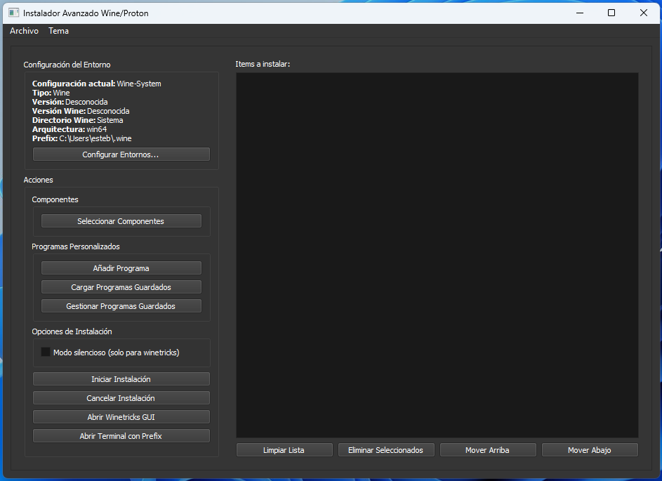

# 🍷 WineProton Manager  


**Herramienta GUI para gestionar entornos Wine/Proton e instalar componentes con interfaz gráfica Qt.**  

🔧 **Características principales**:  
- Gestión de múltiples prefixes (Wine y Proton)  
- Instalación automatizada de componentes via Winetricks  
- Soporte para programas personalizados (.exe/.msi)  
- Interfaz intuitiva con temas claro/oscuro
- Visualización detallada de entornos
- Plataforma (Linux)  

🖼️ **Captura**:  


---

## Requisitos
- Python 3.8+
- PyQt5
- Wine/Proton instalado
- Winetricks

## 🚀 Instalación  
```bash
# Requisitos previos
sudo apt install wine winetricks konsole  # Para Linux

# Clonar repositorio
git clone https://github.com/EstebanKZL/WineProtonManager.git
cd WineProton-Manager

# Instalar dependencias
pip install -r requirements.txt

# Ejecutar
python3 WineProtonManager.py
